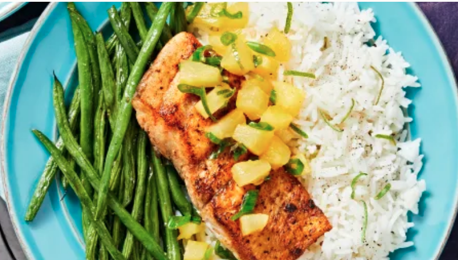

Here's a link to the ingredients, instructions and recipe on Hello Fresh.

<https://www.hellofresh.com/recipes/2019-w20-r13-blackened-barramundi-and-pineapple-salsa-5ca4fa90e3f3397ab6046be2?q=blackened+barramundi>

...description...

Pineapple salsa is our favorite way to feel warm weather vibes all year round. It’s sweet, juicy, and tangy, making it the perfect complement to crispy spiced barramundi. On the side, there’s roasted green beans and fluffy rice mixed with scallions and a squeeze of lime juice. No matter the temperature, one bite of this delicious dish will make everything feel a whole lot sunnier.

Allergens:Fish•Milk

Produced in a facility that processes milk, eggs, fish, shellfish, tree nuts, peanuts, wheat, and soybean.

...and picture from the Hello Fresh web-site...

