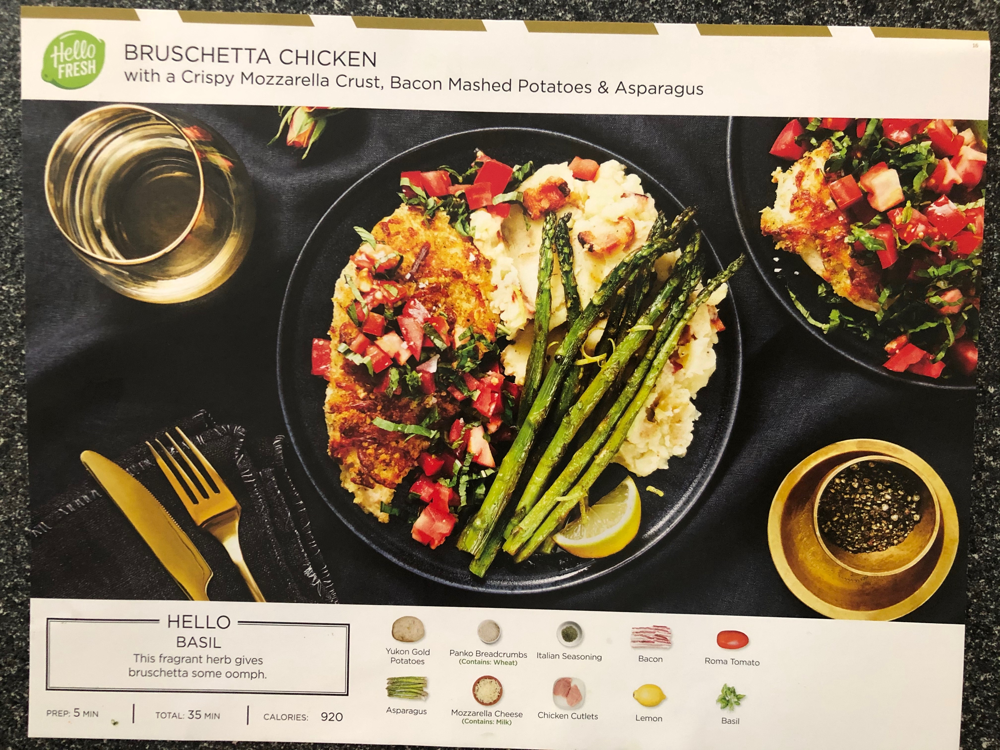
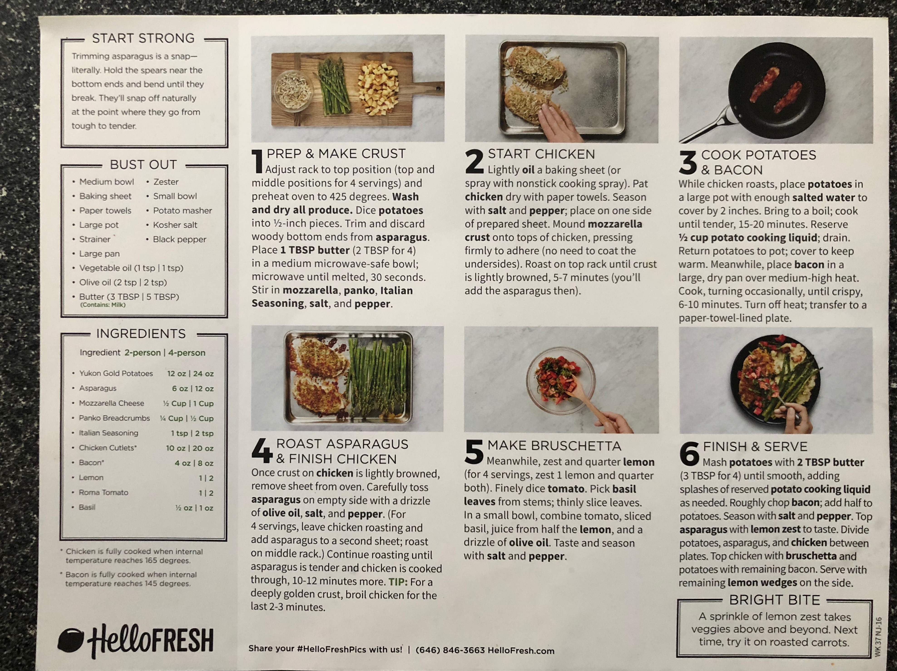

Here's a link to the recipe from the Hello Fresh website.

<https://www.hellofresh.com/recipes/bruschetta-chicken-5d3ef342d6292e001314bfc4/>

Description from HF...

Bruschetta, or to some, “broo-sketta,” is one of those foods that’s just as fun to say as it is to eat. The delicious mixture of chopped juicy tomatoes, lemon juice, and strands of fresh basil—usually piled on top of bread—is pretty tough to beat. So our chefs decided to give it a delicious upgrade. This recipe swaps bread (which, let’s be honest, usually gets a bit soggy!) for golden, panko-and-mozzarella-coated chicken breasts. On the side, there’s creamy mashed potatoes studded with bits of crispy bacon and roasted asparagus tossed with bright lemon zest. One bite will transport you to the Italian countryside.

Tags:Family friendly

Allergens:Wheat•Milk

Produced in a facility that processes milk, eggs, fish, shellfish, tree nuts, peanuts, wheat, and soybean.

Along with the image from their website.

Prep Time - 5 min

Total Time - 35 min

Calories - 920