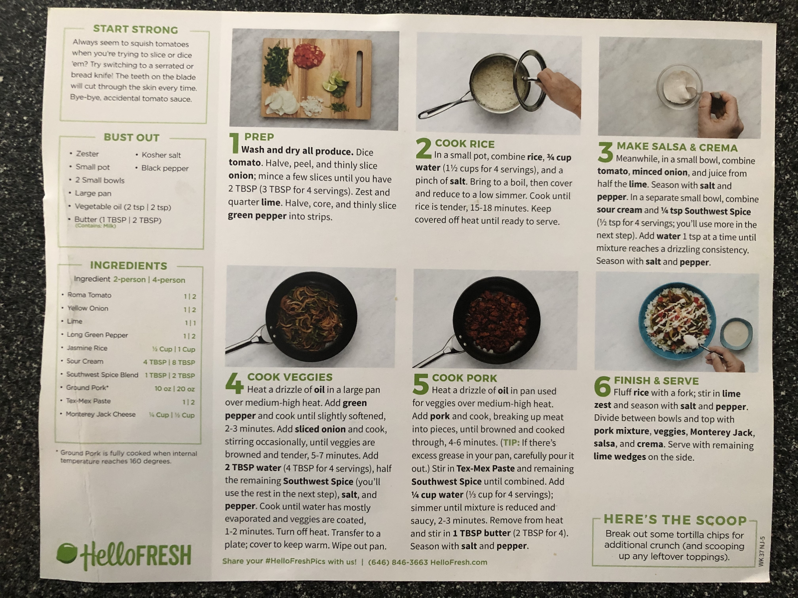

Here's a link to the recipe from the Hello Fresh web-site...

<https://www.hellofresh.com/recipes/tex-mex-pork-enchilada-bowls-5e1e40400c765750b85f2c63/>

...description...

Rice bowls are way beyond “having a moment” and have officially transformed into a dinnertime staple. And why not? They’re hearty, flavorful, and so versatile. This version’s got bold ’n’ saucy pork served over a bed of fluffy lime rice, topped with fresh salsa, pepper jack, and Southwest crema. Yep, this bodacious bowl is sure to satisfy.

Allergens:Milk

Produced in a facility that processes milk, eggs, fish, shellfish, tree nuts, peanuts, wheat, and soybean.

...and picture...

and below are the pictures from the packet we received in September 2020

Prep Time - 10 min

Total Time - 35 min

Calories - 780